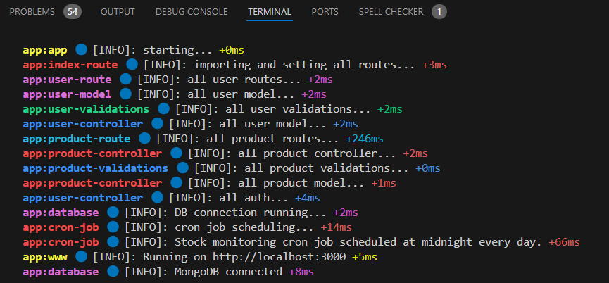

1. extract the zip
2. goto root path
3. make sure .env file updated
4. npm i
5. npm start

# desc

- about Order Management APIs: i couldn't understand the flow and what erectly we want in ordering system
- emailing is setup via gmail system but it is a dummy correndails
- in env PRODUCT_STOCK_MONITORING_CRON_INTERVAL is set every 30 sec we can change what ever we want

# success

- make sure mongodb connected & running on at given PORT
